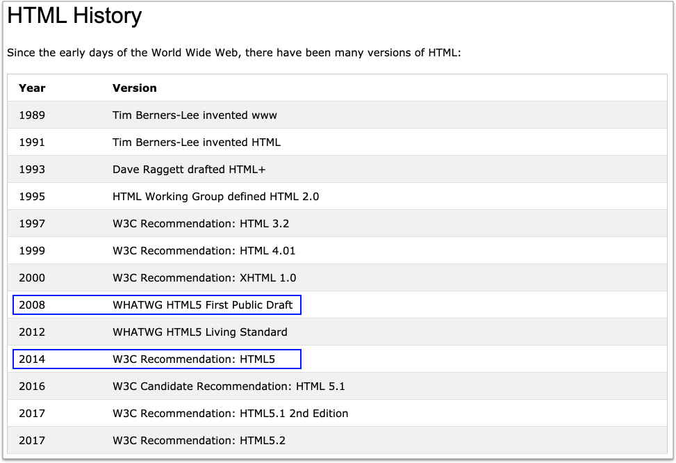

# 1.2 課程簡介

## HTML5 歷史

<figure><figcaption>
<a href="https://www.w3schools.com/html/html_intro.asp">https://www.w3schools.com/html/html_intro.asp</a>
</figcaption></figure>

從上圖可以得知，大約在 2008 年開始在草擬 HTML5 的規範，然後到了 2014 年才開始被 W3C 列為推薦(Recommendation)的版本，逐漸普及於各家瀏覽器。

註：

* **W3C** = **W**orld **W**ide **W**eb **C**onsortium. (全球資訊網協會)。
* **WHATWG** = **W**eb **H**ypertext **A**pplication **T**echnology **W**orking **G**roup. (網頁超文字應用技術工作小組)。

## HTML5 範疇

### 元素

* 新的「語意/結構」標籤。
* input 標籤的類型與屬性。
* 圖形相關標籤。
* Media 相關標籤。

### API

* 與 JavaScript 相關的 API (參考左側導覽列表)。

