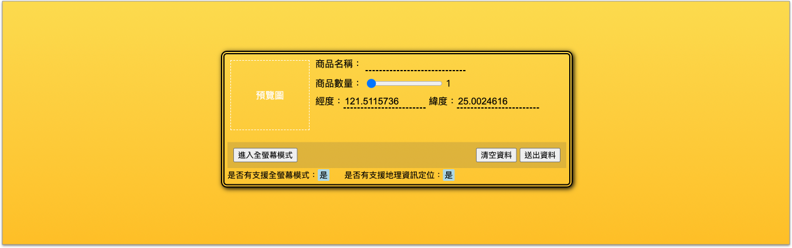
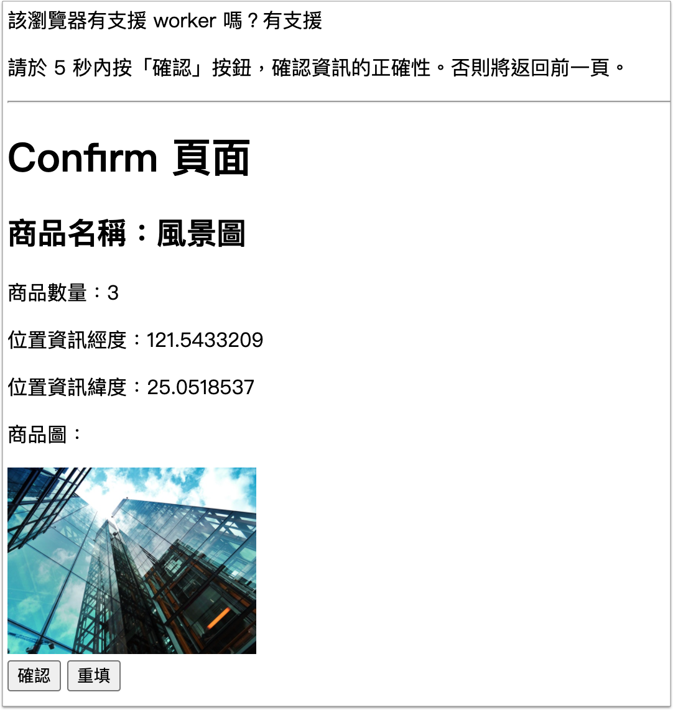

# 10. 作業

## 作業說明

### 一、說明

做兩個網頁，第一個網頁是一份表單，使用者輸入一些資料，然後將資料傳到第二個網頁顯示出來，給使用者做確認；然後第二個網頁可以讓使用者回前一頁去修改資料。

`form.html` 完成示意(有套用 CSS)：

<figure><figcaption></figcaption></figure>

`confirm.html` 完成示意(沒有套用 CSS)：

<figure><figcaption></figcaption></figure>

詳細說明請依照以下步驟製作開發。


### 二、前置

建立 **`html5/homework`** 資料夾，然後在該資料夾內，建立以下兩個檔案，檔名分別是 **`form.html`**、**`confirm.html`**。

然後確認本機端網址可以連，例： `http://127.0.0.1:5500/homework/form.html` 。


也在作業資料夾下，建立 **`css/form.css`**。


## 第一個網頁：form.html

### 步驟一、樣式、商品數量、清空資料按鈕

更新 `form.html` 檔：



`form.html` 檔，body 標籤內放以下原始碼：

```html
<article class="info">
  <form action="#" method="#" id="the_form">
    <div class="content_block">

      <div class="left_block">

        <input type="file" id="p_file">

        <div id="preview" class="drop_zone">
          <span class="text">預覽圖</span>
        </div>

      </div>
      <div class="right_block">

        <div class="block">
          <label>商品名稱：</label>
          <input type="text" id="p_name" autocomplete="off">
        </div>
  
        <div class="block -middle">
          <label>商品數量：</label>
          <input type="range" min="1" max="10" value="1" id="p_count">
          <span id="p_count_value"></span>
        </div>
  
        <div class="block">
          <label>經度：</label><input type="text" id="lng" readonly>
          <label>緯度：</label><input type="text" id="lat" readonly>
        </div>

      </div>

    </div>

    <footer class="footer">
      <div class="action_block">
        <div class="left_block">
          <button type="button" id="btn_fullscreen">進入全螢幕模式</button>
        </div>
        
        <div class="right_block">
          <button type="reset">清空資料</button>
          <button type="submit" id="btn_submit">送出資料</button>
        </div>
      </div>
      <p>是否有支援全螢幕模式：<span id="fullscreen_enable"></span></p>
      <p>是否有支援地理資訊定位：<span id="geolocation_enable"></span></p>
    </footer>
  </form>
</article>
```



**`form.css`** 檔的樣式如下，照貼即可：

```css
*{
  box-sizing: border-box;
}
body{
  background: rgb(225,186,59);
  background: linear-gradient(0deg, rgba(225,186,59,1) 0%, rgba(255,177,0,1) 16%, rgba(252,220,80,1) 100%);
  min-height: 100vh;
  padding-top: 100px;
}
article.info{
  border: 6px double black;
  width: 600px;
  margin: 0 auto;
  padding: 5px;
  border-radius: 10px;
  box-shadow: 2px 2px 8px black;
}
article.info div.content_block div.left_block{
  padding: 5px 10px 10px 5px;
}

article.info #p_name, article.info #lng, article.info #lat{
  border-bottom: 2px dashed black;
  border-top: 0;
  border-right: 0;
  border-left: 0;
  border-radius: 0;
  background: none;
  outline: none;
  font-size: 16px;
}
article.info #lng, article.info #lat{
  width: 140px;
}

article.info footer.footer{
  /* border: 2px solid red; */
  margin-top: 5px;
}
article.info footer.footer p{
  margin: 0;
  font-size: 14px;
  display: inline-block;
}
article.info footer.footer p:last-child{
  margin-left: 20px;
}
article.info footer.footer p > span{
  background-color: lightblue;
  display: inline-block;
  width: 20px;
  text-align: center;
  border-radius: 2px;
}
article.info footer.footer div.action_block{
  display: flex;
  justify-content: space-between;
  background-color: hsla(45deg, 50%, 50%, .5);
  padding: 10px;
}
article.info footer.footer div.action_block button{
  cursor: pointer;
}
article.info footer.footer div.action_block div.left_block{
  /* border: 1px solid red; */
}
article.info footer.footer div.action_block div.right_block{
  /* border: 1px solid green; */
}


article.info div.content_block{
  /* border: 1px solid red; */
  display: flex;
}
article.info div.content_block div.left_block{
  /* border: 1px solid green; */
  flex-basis: 150px;
  flex-shrink: 0;
}

article.info div.content_block div.right_block{
  /* border: 1px solid red; */
  flex-grow: 1;
}
article.info div.content_block div.block{
  margin-bottom: 8px;
}
article.info div.content_block div.block.-middle > *{
  vertical-align: middle;
}
article.info div.content_block div.block:last-child{
  margin-bottom: 0;
}

article.info #p_file{
  display: none;
}
```




完成以下：

1、樣式：`form.html` 頁面，載入 `form.css` 檔案。

2、商品數量：一進到頁面，商品數量的 span 標籤要顯示 1；拉動滑桿，商品數量的 span 標籤，要跟著連動。(三個事件：`mousemove`、`touchmove`、`touchend`)。


### 步驟二、讓網頁畫面進入全螢幕模式


結果示意：[https://youtu.be/kw8zk9jYIhw](https://youtu.be/kw8zk9jYIhw)




主要提示如下：

`document.fullscreenEnabled`：判斷瀏覽器是否有支援全螢幕模式。

`document.fullscreenElement`：取得目前進入全螢幕模式的元素。

`document.exitFullscreen()`：離開全螢幕模式。

`{element}.requestFullscreen()`：讓 element 進入全螢幕模式。


### 步驟三、使用 Geolocation 取得使用者位置經緯度

結果示意：[https://youtu.be/zF7wFUQ6FOM](https://youtu.be/zF7wFUQ6FOM)




主要提示如下：

在 `<style>` 標籤加以下 css：

```css
input[disabled]{
  background-color: #eee;
  cursor: not-allowed;
}
```


經度 html：

```markup
<label>經度：</label><input type="text" id="lng" readonly>
```

緯度 html：

```markup
<label>緯度：</label><input type="text" id="lat" readonly>
```

使用者若同意取得，則將取得的經緯度資料，放到以上各自的 input 標籤。

使用者若不同意取得，就將上述兩個欄位加上 **`disabled`** 屬性。


### 步驟四、使用 Drag and Drop 拖曳檔案


結果示意：[https://youtu.be/Mwhd90jGnUs](https://youtu.be/Mwhd90jGnUs)




主要提示如下：

圖片拖曳至此處的 html：

```markup
<div id="drop_zone"><span class="text">圖片拖曳至此處</span></div>
```

圖片拖曳至此處的 css：

```css
#drop_zone{
  border: 1px dashed #ccc;
  height: 50px;
  position: relative;
}
#drop_zone span.text{
  position: absolute;
  display: inline-block;
  left: 50%;
  top: 50%;
  transform: translate(-50%, -50%);
  z-index: -1;
  color: lightgray;
}
#drop_zone.-on{
  border: 1px dashed lightblue;
  box-shadow: 3px 3px 5px lightblue inset, -3px -3px 5px lightblue inset;
}
```

有用到的事件：

* dragover
* dragenter
* dragleave
* drop

其它提示：

* `drop` 事件要加上 `e.preventDefault()`，才能夠允許取得視窗拖曳過來的檔案。
* `e.dataTransfer.files`：可以取得從視窗拖曳過來的檔案(即 `FileList`)。於 console 顯示出來觀察。


### 步驟五、透過 File 物件顯示預覽圖

從 「自己電腦」 拖曳圖片檔案，或點選 「商品圖片」 來選圖，都呈現預覽圖。為簡化，做選一張圖就好。

結果示意：[https://youtu.be/rcs1F3SJSsg](https://youtu.be/rcs1F3SJSsg)




提供 html：

```markup
<div id="preview"><span class="text">預覽圖</span></div>
```

提供 css：

```css
#preview{
  border: 1px solid lightgray;
  display: inline-block;
  width: 100px;
  min-height: 150px;
  position: relative;
}
#preview span.text{
  position: absolute;
  display: inline-block;
  left: 50%;
  top: 50%;
  transform: translate(-50%, -50%);
  z-index: -1;
  color: lightgray;
}
#preview img.preview_img{
  width: 100%;
}
```


其它提示：

* `new FileReader()`：FileReader 物件，用來讀取檔案。
* `reader.readAsDataURL(file)`：執行讀取檔案。
* `reader.addEventListener("load", function () {  })`：監聽檔案讀取完成。
* `reader.result`：圖片的 `Base64 編碼格式`，可放進圖片的 `src` 屬性當中。
* 按下 「`清空資料`」 按鈕，也要將「`預覽圖`」區域，回到原來的介面。


### 步驟六、使用 Session Storage 儲存資料

做到這邊，共有以下幾個資料可以取得：

* 商品名稱。
* 商品數量。
* 商品圖片(Base64)。
* 使用者位置經度：(若使用者有同意取得的話)。
* 使用者位置緯度：(若使用者有同意取得的話)。


在按下 「`送出資料`」 按鈕時，將以上資料存到 **`Session Storage`**，並且將頁面導向到 `confirm.html` 頁面。


定義資料儲存的格式：

* `key` 的名稱為：`form_data`
* `value` 的格式為以下範例：

```javascript
{
  p_name: "這是商品名稱",
  p_count: "5",
  img_base64: "abdee",
  position: {
    lng: "121.12345",
    lat: "21.12345"
  }
}
```


結果示意：[https://youtu.be/f0NS3olUinY](https://youtu.be/f0NS3olUinY)




## 第二個網頁：confirm.html


### 步驟一、從 Session Storage 取得資料並顯示在頁面上

將 sessionStorage 的資料，顯示在 `confirm.html` 網頁上，資料有：

* 商品名稱
* 商品數量
* 位置資訊經度
* 位置資訊緯度
* 商品圖

結果示意：[https://youtu.be/smWN8ldrbu8](https://youtu.be/smWN8ldrbu8)




### 步驟二、使用 Web Worker 計時

在 `homework` 資料夾內，建立 `js` 資料夾，然後在其內建立  `worker_countdown.js` 檔案。

使用 worker 來倒數計時 10 秒，10秒內要確認資料，若數完 10 秒，則畫面停住就不再計時；需在 10 秒內按下 「確認」 按鈕然後，結束 worker 的倒數計時。


結果示意：[https://youtu.be/oPB55QzYuVU](https://youtu.be/oPB55QzYuVU)




### 步驟三、重填，使用 history 返回前頁

* 接續上個步驟，倒數完 10 秒之後，返回前一頁重填資料；或按下 「重填」 按鈕，返回前一頁重填資料。
* 返回前一頁時，需判斷 `sessionStorage.getItem("form_data")` 是否有資料，若有的話，需將資料填回到原本的表單。
* 若按下 「清空資料」 按鈕，也需將 `sessionStorage` 裡的資料清空。


結果示意：[https://youtu.be/1nDKFAzDINA](https://youtu.be/1nDKFAzDINA)




## 繳交方式

最晚繳交日期：**0/(日)** 晚上 12 點之前。

請將 `homework` 資料夾壓成壓縮檔，然後透過以下網址繳交：

前端班： [https://frontend.tibame.com/](https://frontend.tibame.com/)

Java 班： [https://java.tibame.com/](https://java.tibame.com/)


## 參考作法

