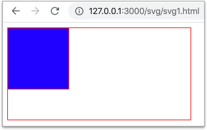
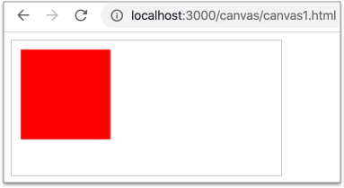

# 2.4 圖形相關標籤

## \<svg>

* **SVG** = **S**calable **V**ector **G**raphics。
* 向量式圖形，放大都不會產生模糊現象。

在 `html5` 資料夾底下，建立一個 `svg` 的資料夾，然後在 `svg` 資料夾下，建立 `svg1.html` 檔案，以便執行以下的範例。

### 範例1：在 HTML 中顯示 svg 格式的圖片

因為 html5 版本的網頁文件，看得懂 svg 相關標籤，所以可直接用 svg 標籤就可以了。



```markup
<!DOCTYPE html>
<html lang="zh-Hant">
  <head>
    <meta charset="utf-8">
    <title></title>
    <style>
      svg{
        border: 1px solid black;
      }
    </style>
  </head>
  <body>
    <svg>
      <rect x="0" y="0" height="100" width="100" style="stroke:#ff0000; fill: #0000ff" />
    </svg>
  </body>
</html>
```



呈現結果：

<figure><figcaption></figcaption></figure>


### 範例2：如何在 html 中使用 img 標籤來顯示 svg

在 `svg` 資料夾中，建立 `images` 資料夾，然後在 `images` 資料夾中，建立 `rect.svg` 檔案，內容如下：

```markup
<svg>
  <rect x="0" y="0" height="100" width="100" style="stroke:#ff0000; fill: #0000ff"/>
</svg>
```

在 `svg` 資料夾中，建立 `svg2.html` 檔案，內容如下：

```markup
<!DOCTYPE html>
<html lang="zh-Hant">
  <head>
    <meta charset="utf-8">
    <title></title>
    <style>
      img{
        border: 1px solid red;
      }
    </style>
  </head>
  <body>
    
  </body>
</html>
```

會發現雖然路徑正確，但確無法正確的呈現 svg，如下圖：

<figure><figcaption></figcaption></figure>

這是因為命名空間的問題，只要加上 `xmlns` 命名空間屬性及其值即可，故將 `rect.svg` 內容改成如下(僅加上 xmlns 屬性及其值)：

```markup
<svg xmlns="http://www.w3.org/2000/svg">
  <rect x="0" y="0" height="100" width="100" style="stroke:#ff0000; fill: #0000ff" />
</svg>
```

就可以正確呈現了。觀察看看。


### 範例3：svg text path and animation

建立 `svg3.html` 檔案，撰寫如下效果。




其它參考

[d3.js](https://d3js.org/) 就是用 **svg** 畫出來的資料視覺化函式庫。


## \<canvas>

* 是一種點陣式的畫布，放大會有模糊現象。
* 使用 **`<canvas>...</canvas>`** 標籤之後，剩下全部都要寫 JavaScript 來繪圖或做小遊戲。

在 `html5` 資料夾下，建立 `canvas` 資料夾，然後在其底下，建立 `canvas1.html` 檔案，以便測試。

### 範例1：在 HTML 中使用 canvas



```markup
<!DOCTYPE html>
<html lang="zh-Hant">
  <head>
    <meta charset="utf-8">
    <title></title>
    <style>
      canvas{
        border: 1px solid #cccccc;
      }
    </style>
  </head>
  <body>
    <canvas id="canvas_item">
      不支援 HTML5 Canvas(如果瀏覽器不支援 canvas，就會顯示此文字)
    </canvas>

    <script>
      // 第一步：取得 id="canvas_item" 元素
      var canvas = document.getElementById("canvas_item");

      // 第二步：從 canvas 中，取得 2D context 物件
      var context = canvas.getContext("2d");

      // 第三步：使用 context 繪圖
      context.fillStyle = "#ff0000";
      context.fillRect(10,10, 100,100);
    </script>
  </body>
</html>
```



結果如下圖：


<figure><figcaption></figcaption></figure>


### 範例2：QRCode(使用 QR Canvas)

套件名稱： [QR Canvas](https://gera2ld.github.io/qrcanvas/docs/) 。




### 範例3：圖表(使用 Chart.js)

套件名稱：[Chart.js](https://www.chartjs.org/)。

用途：繪製圖表，就是在 `<canvas>...</canvas>` 標籤上繪製圖表。

試著建立 `chartjs.html` 檔案，建立跟以下 Codepen 一樣的結果：



下載 **`chart.umd.js`** 檔案，然後最後一行可移除，如下示意：

<figure><figcaption></figcaption></figure>


