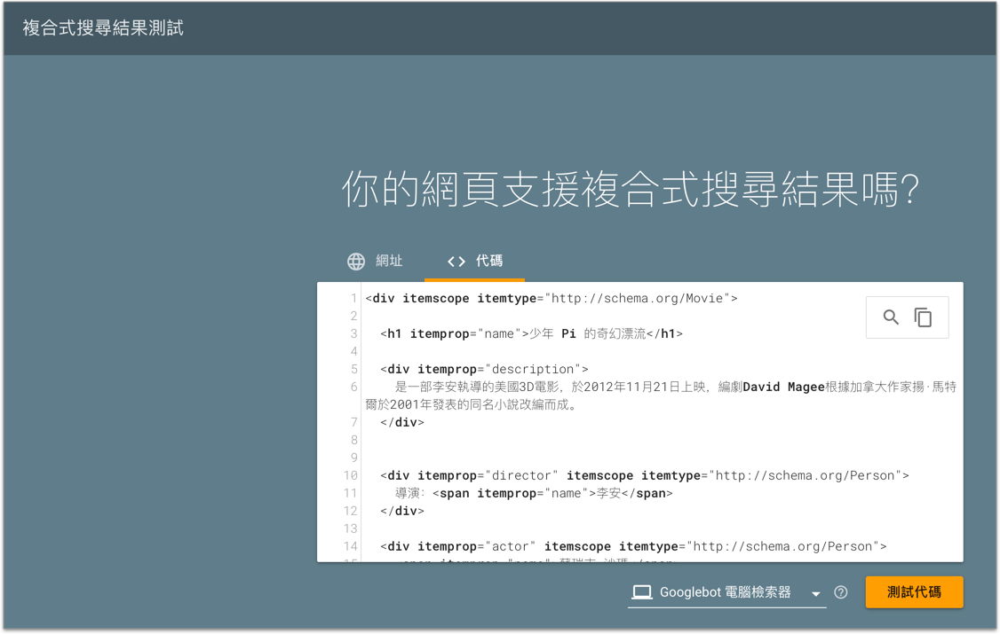
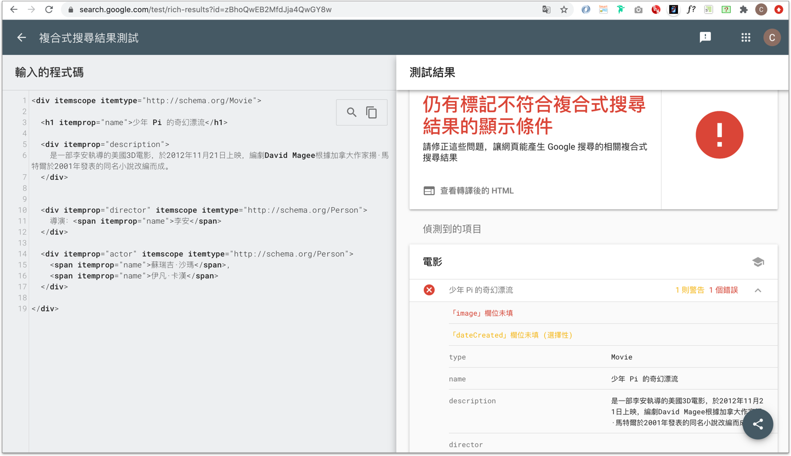
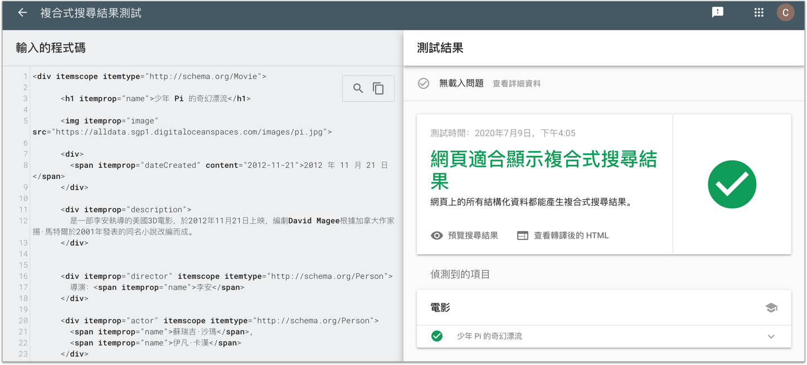

# 3.4 google 結構化資料

## 結構化資料測試

目前我們有一個檔案內容( `microdata1.html` )如下：

```markup
<div itemscope itemtype="http://schema.org/Movie">

  <h1 itemprop="name">少年 Pi 的奇幻漂流</h1>

  <div itemprop="description">
    是一部李安執導的美國3D電影，於2012年11月21日上映，編劇David Magee根據加拿大作家揚·馬特爾於2001年發表的同名小說改編而成。
  </div>


  <div itemprop="director" itemscope itemtype="http://schema.org/Person">
    導演：<span itemprop="name">李安</span>
  </div>

  <div itemprop="actor" itemscope itemtype="http://schema.org/Person">
    <span itemprop="name">蘇瑞吉·沙瑪</span>,
    <span itemprop="name">伊凡·卡漢</span>
  </div>

</div>
```

就可以藉由 Google 的複合式搜尋結果測試：[https://search.google.com/test/rich-results](https://search.google.com/test/rich-results)

請測試看看有沒有問題？直接將上述原始碼放進去，並選擇「Googlebot 電腦檢索器」，如下圖：




按下「測試代碼」，執行結果如下，發現有錯誤：



請先試著修正看看。

範例圖片路徑：[https://alldata.sgp1.digitaloceanspaces.com/images/pi.jpg](https://alldata.sgp1.digitaloceanspaces.com/images/pi.jpg)

## 修正後，沒有錯誤及警告訊息的結構

多了 `itemprop="image"` 及 `itemprop="dateCreated"` 相關：


```markup
<div itemscope itemtype="http://schema.org/Movie">

  <h1 itemprop="name">少年 Pi 的奇幻漂流</h1>

  
  
  <div>
    <span itemprop="dateCreated" content="2012-11-21">2012 年 11 月 21 日</span>
  </div>

  <div itemprop="description">
    是一部李安執導的美國3D電影，於2012年11月21日上映，編劇David Magee根據加拿大作家揚·馬特爾於2001年發表的同名小說改編而成。
  </div>


  <div itemprop="director" itemscope itemtype="http://schema.org/Person">
    導演：<span itemprop="name">李安</span>
  </div>

  <div itemprop="actor" itemscope itemtype="http://schema.org/Person">
    <span itemprop="name">蘇瑞吉·沙瑪</span>,
    <span itemprop="name">伊凡·卡漢</span>
  </div>

</div>
```


再度測試，發現沒有錯誤也沒有警告訊息了：




最後按下「預覽搜尋結果」按鈕，可以得知，google 可能會出現的搜尋結果，如下圖：

.png>)


## google 工具

Explore the search gallery(瀏覽搜尋結果)：[https://developers.google.com/search/docs/guides/search-gallery](https://developers.google.com/search/docs/guides/search-gallery)

找到 Movie，看看 Google 的結構化資料，支援 microdata 寫法，但官方建議另一種寫法，格式是 JSON-LD。


使用工具 markup-helper 來幫助我們撰寫 JSON-LD：[https://www.google.com/webmasters/markup-helper/u/0/](https://www.google.com/webmasters/markup-helper/u/0/)


建立 `microdata/microdata2.html` 檔案，內容如下：

```markup
<!DOCTYPE html>
<html lang="zh-Hant">
  <head>
    <meta charset="utf-8">
    <title></title>
  </head>
  <body>

    <div>

      <h1>少年 Pi 的奇幻漂流</h1>

      

      <div>
        <span>2012 年 11 月 21 日</span>
      </div>

      <div>
        是一部李安執導的美國3D電影，於2012年11月21日上映，編劇David Magee根據加拿大作家揚·馬特爾於2001年發表的同名小說改編而成。
      </div>


      <div>
        導演：<span>李安</span>
      </div>

      <div>
        <span>蘇瑞吉·沙瑪</span>,
        <span>伊凡·卡漢</span>
      </div>

    </div>

  </body>
</html>
```


將以上的程式碼，丟到 markup-helper 工具，用標記的方式完成，請試試看。


### 產生結果

```markup
<!DOCTYPE html>
<html lang="zh-Hant">
  <head>
    <meta charset="utf-8">
    <title></title>
    <!-- JSON-LD markup generated by Google Structured Data Markup Helper. -->
    <script type="application/ld+json">
      {
        "@context" : "http://schema.org",
        "@type" : "Movie",
        "name" : "少年 Pi 的奇幻漂流",
        "image" : "https://alldata.sgp1.digitaloceanspaces.com/images/pi.jpg",
        "datePublished" : "2015-07-27",
        "description": "是一部李安執導的美國3D電影，於2012年11月21日上映，編劇David Magee根據加拿大作家揚·馬特爾於2001年發表的同名小說改編而成。",
        "actor" : [ {
          "@type" : "Person",
          "name" : "蘇瑞吉·沙瑪"
        }, {
          "@type" : "Person",
          "name" : "伊凡·卡漢"
        } ],
        "director" : {
          "@type" : "Person",
          "name" : "李安"
        }
      }
    </script>
  </head>
  <body>

    <div>

      <h1>少年 Pi 的奇幻漂流</h1>

      

      <div>
        <span>2012 年 11 月 21 日</span>
      </div>

      <div>
        是一部李安執導的美國3D電影，於2012年11月21日上映，編劇David Magee根據加拿大作家揚·馬特爾於2001年發表的同名小說改編而成。
      </div>


      <div>
        導演：<span>李安</span>
      </div>

      <div>
        <span>蘇瑞吉·沙瑪</span>,
        <span>伊凡·卡漢</span>
      </div>

    </div>

  </body>
</html>
```



留意 datePublished 日期格式不符合。那就需要手動修正了。(改成 2012-11-21 )

修正後，可再將完成原始碼丟到「[複合式搜尋結果測試](https://search.google.com/test/rich-results)」再進行測試。


以及 description 是自行加上。(只是 google 最後的呈現結果未用到)。



參考：[複合式搜尋結果是什麼？](https://blog.sharktech.tw/2019/01/07/what-are-rich-results)

