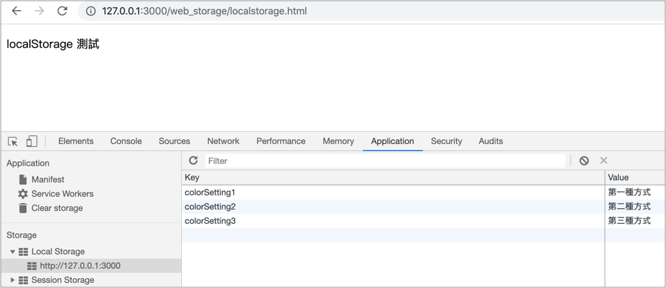
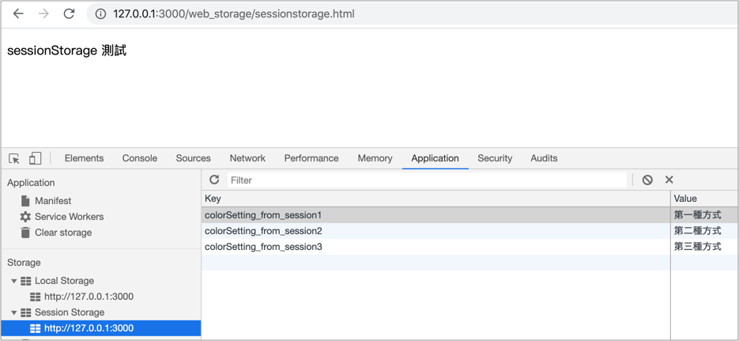

# 4.2 資料儲存

## localStorage 儲存

開啟 `localstorage.html` 檔案來編輯。

以下是將資料儲存在 localStorage 的三種寫法，以 `key-value` 的方式儲存，例：

```javascript
localStorage.colorSetting1 = '第一種方式';
localStorage['colorSetting2'] = '第二種方式';
localStorage.setItem('colorSetting3', '第三種方式');
```

開啟本機端網址來觀察：`http://127.0.0.1:5500/web_storage/localstorage.html`

如下圖：




儲存 JSON 格式資料，使用 **`JSON.stringify()`**&#x5C07;資料字串化：

```javascript
localStorage.setItem("car", JSON.stringify({doors: 4, brand_name: "toyota"}));
```


## sessionStorage 儲存

開啟 `sessionstorage.html` 檔案來編輯。

以下是將資料儲存在 sessionStorage 的三種寫法，以 `key-value` 的方式儲存，例：

```javascript
sessionStorage.colorSetting_from_session1 = '第一種方式';
sessionStorage['colorSetting_from_session2'] = '第二種方式';
sessionStorage.setItem('colorSetting3', '第三種方式');
```

開啟本機端網址來觀察(關閉分頁後，資料就會消失)：`http://127.0.0.1:5500/web_storage/sessionstorage.html`

如下圖：



