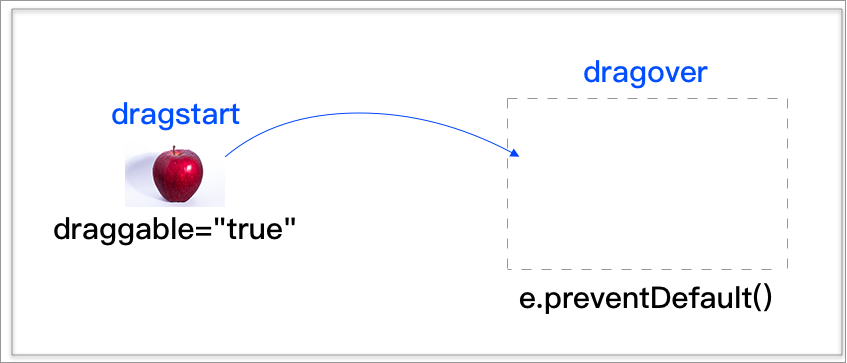

# 7.1 簡介及主要事件說明

## 簡介

在網頁上的任何元素，都是可以被拖曳到其它位置。

製作原則如下：

* 元素如果要可以被拖曳(下圖的圖片)，需加上 **`draggable="true"`** 屬性。(例外：圖片、連結 可以不用加)
* `dragstart`：被拖曳的元素(圖片)加上此事件。
* `dragover`：虛線框加上 dragover 事件。(通常可能是 `div` 標籤)\
  在預設的情況下，不允許任何元素被拖曳至此處；如要允許，需停止該元素的預設行為( `e.preventDefault()` )
*   `drop`：將某元素拖曳到某區域上，放開時觸發。

    若要從自己的電腦拖曳檔案進來頁面上的區域，需透過 `e.preventDefault()` 來停掉預設行為。

示意圖：

<figure><figcaption></figcaption></figure>

## 關於 e.dataTransfer

在從自己的電腦檔案總管，拖曳檔案到頁面上，可透過 **`e.dataTransfer.files`** 來取得**使用者從自己電腦拖曳檔案過來的 FileList**。

## 建立資料夾

請建立 **`html5/drag_and_drop`** 資料夾。

