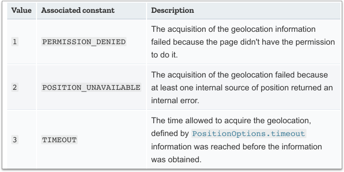

# 相關 API

JS 當中的 `navigator` 物件(也在 `window` 物件底下)讓你可以存取使用者的瀏覽器資訊，也包含了 `geolocation` 相關資訊。

任意開啟一個網頁，在 Console 中執行以下程式，即可看到 navigator 包含了哪些東西：

```javascript
navigator;
```

結果如下圖：


從上圖我們可以看到 **`navigator.geolocation`** 物件，就是跟地理定位有關的 API。


## 範例 1：取得使用者位置：getCurrentPosition()

### 判斷使用者的瀏覽器是否有支援 Geolocation

```javascript
if (navigator.geolocation) {
  // 有支援
}
```

### 取得使用者的位置資訊

透過以下程式(註：會以**非同步**方式取得資訊)：

```javascript
navigator.geolocation.getCurrentPosition(function(position){
  // 取得 position 位置資訊，可於 console 中印出來看看
  console.log(position);
});

alert("不需要等到取得位置資訊，才執行。會直接執行這裡的程式");
```

### 主要資訊

* **`position.coords.longitude`**：經度
* **`position.coords.latitude`**：緯度
* **`position.timestamp`**：取得位置資訊的時間，[Unix Time Stamp 參考](https://www.unixtimestamp.com/)。


### 練習

建立 `html5/geolocation/geolocation.html` 檔案，html 內容如下：

```markup
<button type="button" id="get_position">取得經緯度</button>

<p>經度：<span id="lng"></span></p>
<p>緯度：<span id="lat"></span></p>
<p>時戳：<span id="timestamp"></span></p>
```

點擊 「取得經緯度」 按鈕，取得經度、緯度、時戳，並於頁面上呈現(三個 span 標籤)。


參考作法( [https://codepen.io/carlos411/pen/NWvZNXV](https://codepen.io/carlos411/pen/NWvZNXV) )：




## 範例 2：使用者不同意取得位置資訊時


繼續編輯 `geolocation.html` 檔案，只要在 `navigator.geolocation.getCurrentPosition()` 函式中帶入第二個函式參數：

```javascript
navigator.geolocation.getCurrentPosition(function(position){
  
  // 取得 position 位置資訊，可於 console 中印出來看看
  console.log(position);
  
}, function(error){

  // 使用者不同意取得位置資訊時
  alert('使用者不同意取得位置資訊或尚未取得位置資訊：ERROR(' + error.code + '): ' + error.message);
  
});
```

在測試的時候，如果已經 「同意」 或 「拒絕」 過，可能就不會再跳出訊息，所以記得刪除記錄。


下表是 error 物件的參考資料：

<figure><figcaption></figcaption></figure>


## 範例 3：其它參數

第三個參數，有以下資訊可以設定：

**`enableHighAccuracy`**：預設值 **`false`**。是否要回傳較精確的位置。\
如果值為 **true** 且該裝置具備提供精準位置的能力，則方法會回傳較精確的位置。\
如果值為 **false**，設備會因為**回應時間較短**以及**消耗較少的電力**達到資源節省。

**`maximumAge`**：**`預設值為 0`**(毫秒)，**代表設備必須回傳實際的當前位置**而不能使用暫存位置。如果設定為 `Infinity`， 機器必定會回傳暫存位置。

**`timeout`**：時間(單位是毫秒)。如果在時間內還沒有回傳位置資訊的話，就會自動執行第二個 error 函式。參數預設值是 **`Infinity`**，代表 `getCurrentPosition()` 若沒有取得位置資訊的話，不會有任何回覆。


範例：

試著將以下資料，帶入 getCurrentPosition 的第三個參數：

```javascript
{
  enableHighAccuracy: true,
  maximumAge: 0,
  timeout: 5000
}
```

試著將 `timeout` 改小一點 例如 100，那麼在 100 毫秒內，瀏覽器還無法取得資料的話，就會 timeout，然後就會執行第二個函式參數的程式。


完整參考作法( [https://codepen.io/carlos411/pen/JjyQXar](https://codepen.io/carlos411/pen/JjyQXar) )：




## 範例 4：監控使用者位置：watchPosition()

用手機實際監測：




第一部份：先加入一個函式，傳入 UNIX Timestamp，然後回傳「時:分:秒」，主要用來確認位置資訊的確有更新：

```javascript
// 傳入 timestamp，然後回傳「時:分:秒」
function parse_from_timestamp(unix_timestamp){
  var date = new Date(unix_timestamp);
  return date.getHours() + ':' + date.getMinutes() + ':' + date.getSeconds();
}
```

第二個部份：**`watchPosition()`** 與 getCurrentPosition() 所傳入的三個參數一模一樣。\
差別在於 **`watchPosition()`** 會回傳一組 ID 編號，所以先宣告此變數，待呼叫 watchPosition() 時承接：

```javascript
var watcherID;

watcherID = navigator.geolocation.watchPosition(successFunc, errorFunc, options);
```

第三個部份：只要切換分頁或位置資訊改變，都會再重新執行 `successFunc` 裡的程式，如果要停止追蹤，可將 watcherID 代入 **`clearWatch()`** 函式即可。例：

```javascript
navigator.geolocation.clearWatch(watcherID);
```


範例：(可試著切換分頁，即可看到資訊改變)，也可用手機開啟這個頁面，在戶外走的時候，觀察看是否有更新資料：



